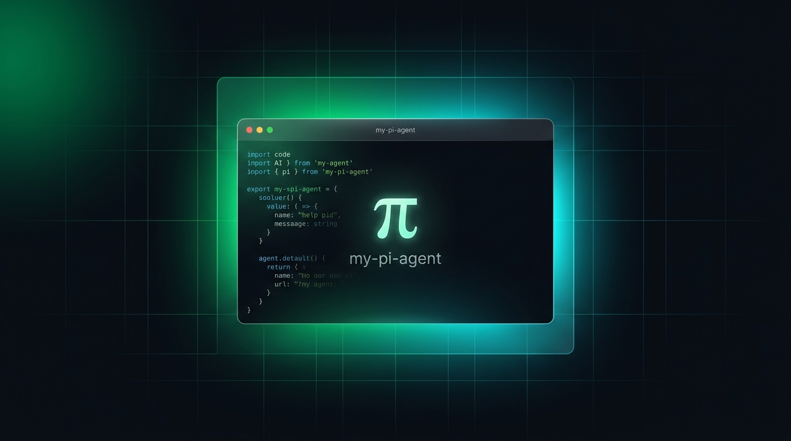

# my-pi-agent

<p align="center">
  
</p>

<p align="center">
  <strong>基于 Python 纯原生手写的极简 Agent 框架微内核与 1:1 像素级 Pi-TUI 终端交互套件。</strong>
</p>

<p align="center">
  <a href="https://www.npmjs.com/package/my-pi-agent"></a>
  <a href="LICENSE"></a>
  <a href="https://zxj-2023.github.io/categories/agent%E5%AE%9E%E6%88%98/my-pi-agent/"></a>
  <a href="#"></a>
  <a href="#"></a>
</p>

<p align="center">
  <a href="#-快速开始-quickstart">快速开始</a>
  ·
  <a href="#-什么是-my-pi-agent">架构拓扑</a>
  ·
  <a href="#-核心特性全景-what-my-pi-agent-can-do">核心特性</a>
  ·
  <a href="#-设计哲学-philosophy">设计哲学</a>
  ·
  <a href="#-作为-python-库使用-use-as-a-library">Python SDK</a>
  ·
  <a href="docs/README.md">技术设计文档中心</a>
  ·
  <a href="https://zxj-2023.github.io/categories/agent%E5%AE%9E%E6%88%98/my-pi-agent/">专栏精读</a>
</p>

---

## 📖 什么是 my-pi-agent？

**`my-pi-agent` 是一个驻留在你的终端里的全功能编程智能体（Coding Agent）。**

你可以像使用资深工程师伙伴一样向它提问：“解释这个代码库”、“编写自动化测试”、“定位并修复此异常日志”。它会在受控权限内自主读取源码、外科手术式精准修改、执行测试命令、通过树状 DAG 会话持久化上下文，并以 **100% 像素级对齐 Pi 原厂终端** 的极速 TUI 将模型思考过程与工具调用动态流式呈现。

它**不引入任何重型 Agent 框架**（LangChain / LangGraph 等），从零手写、完全透明、每一行代码均可单步调试学习，严格遵循 TDD 与 100% 离线单元测试。

### 架构边界与分层设计

对标业界标杆 Tau 与 Pi 的清晰设计哲学，项目严格划分为四大职责单一的正交层：

```text
tui (Node.js / Pi-TUI)  ⇄ [stdio JSON-RPC 2.0] ⇄  my_coding_agent  →  my_agent_core  →  my_agent_llm
```

```text
┌─────────────────────────┐     ┌──────────────────────────────────────────────────────────┐
│  AgentHarness (通用微内核) │ ──▶ │ 纯粹的 Agent 通用大脑：ReAct 循环、事件、Hooks、会话树、压缩管线 │
└─────────────────────────┘     └──────────────────────────────────────────────────────────┘
             │
             ▼
┌─────────────────────────┐     ┌──────────────────────────────────────────────────────────┐
│  CodingAgent (产品环境层)  │ ──▶ │ 编码产品业务包装：7大文件工具、单文件写锁、权限门禁、项目上下文 │
└─────────────────────────┘     └──────────────────────────────────────────────────────────┘
             │
             ▼
┌─────────────────────────┐     ┌──────────────────────────────────────────────────────────┐
│    Pi-TUI (终端表现层)   │ ──▶ │ 基于 @earendil-works/pi-tui 的极速重绘终端：差量刷新、输入框动效 │
└─────────────────────────┘     └──────────────────────────────────────────────────────────┘
```

- **`my_agent_llm`**：多提供商翻译层，将 OpenAI、DeepSeek、Anthropic 与 Antigravity（Google internal SSE）统一抽象为中立的流式事件与类型安全的结构化 `ToolCall`；
- **`my_agent_core`**：通用的便携 Agent 微内核，管理状态机循环、12 个只读生命周期事件、五大专职 Hook 决策拦截点、树状 Session 与廉价优先四层压缩；
- **`my_coding_agent`**：专注代码工程的产品层，封装 7 大工作区编码工具、`FileMutationQueue` 细粒度并发锁、`PermissionGate` 权限门禁与 stdio JSON-RPC 2.0 服务端；
- **`tui`**：独立前端展示层，基于 Mario Zechner 原厂终端引擎 `@earendil-works/pi-tui`，提供无闪烁差量渲染与高辨识度卡片视觉系统。

---

## ⚡ 快速开始 (Quickstart)

### 途径 A：npm 全球一键安装（推荐，面向终端用户）

无需克隆代码仓库，只需确保电脑安装了 Node.js (>=18) 与 Python 极速工具 [uv](https://docs.astral.sh/uv/)（`my-pi-agent` 会通过 `uv run` 全自动接管依赖与内核，用户**无需手动配置虚拟环境**）：

```bash
# 全局安装 CLI
npm install -g my-pi-agent

# 在任意项目目录下直接启动终端
my-pi-agent
# 或使用快捷别名
my-agent

# 亦可免安装秒级拉起体验
npx my-pi-agent
```

### 命令行常用参数 (CLI Options)

```text
Usage:
  my-agent [options] [prompt]

Options:
  -c, --continue          一键续接当前项目最近一次历史会话
  -r, --resume [id]       启动时直接打开交互式会话选择器或恢复指定会话
  --new-session           强制开启全新会话 (默认)
  -n, --name <title>      启动时直接为该会话命名
  -m, --model <model>     指定生效模型 (如 deepseek-chat, gemini-3.8-flash)
  --thinking <level>      指定思考深度等级 (off/minimal/low/medium/high/max)
  --no-session            内存无痕沙箱模式 (不持久化 session 文件)
  -w, --workspace <dir>   指定工作区目录 (默认: 当前目录)
  --mode <mode>           权限安全模式: review (默认) | yolo | strict
  -h, --help              查看帮助说明
```

---

### 途径 B：源码克隆与本地开发运行（面向贡献者与学习者）

```bash
# 1. 克隆代码仓库
git clone https://github.com/zxj-2023/my-pi-agent.git
cd my-pi-agent

# 2. 安装 Python 依赖并同步全局虚拟环境 (.venv)
uv sync

# 3. 安装前端 TUI 依赖并编译 TypeScript
npm install
npm run build

# 4. 运行全量离线自动化测试套件 (100% 绿灯全通)
uv run python -m pytest   # 666 Python tests passed
npm test                  # 58 TUI tests passed

# 5. 启动开发态终端
npm start
```

---

## ✨ 核心特性全景 (What my-pi-agent can do)

- **100% 像素级 Pi 原厂终端体验 (`tui/`)**：
  - **`CustomEditor` 顶部嵌入动效**：在模型思考或工具执行期间，输入框顶部边框实时挖槽嵌入 Braille 10 帧高频旋转指示器（`── ⠸ Working ──`），完成时平滑自愈；
  - **思考预算深度自适应轮转**：支持 `Shift+Tab` / `Ctrl+T` 快捷键原地切换推理深度（`off` ➔ `low` ➔ `medium` ➔ `high` ➔ `max`），并联动输入框边框颜色动态变换；
  - **三大交互模态选择器**：`ModelSelector`（支持 `Ctrl+S` 持久化默认模型）、`SessionSelector`（多级 DAG 分支线 + `Ctrl+D` 历史会话删除与活跃会话安全拦截）、`ThinkingSelector`；
  - **可折叠卡片系统 (`Ctrl+O`)**：流式思考过程折叠块、上下文压缩摘要卡片（`[compaction]`）、细线圆角工具执行卡片；
  - **输入行即时宏扩展管道 (`MacroEngine`)**：`!cmd`（执行并追加上下文）、`!!cmd`（静默排查零 Token 消耗）、`/skill:` 展开、`/<template>` 变量参数化注入；
  - **财务级双行状态栏 (`FooterComponent`)**：紧凑呈现工作区、模型、分级 Token、成本核算、上下文窗口占比与真实 Prompt Cache 命中率（`CH%`）。
- **7 大工作区核心编码工具 (`tools/`)**：
  - `read`（2000行/50KB截断保护）、`write`（原子覆写）、`edit`（精准替换与单块容错）、`bash`（100ms流式输出+后台作业+危险黑名单拦截）、`grep`（`context`/`glob`支持）、`find`（1000限制）、`ls`（500项截断+大小写忽略排序）；
  - `resolve_path` 宽松 CWD 路径解析（对标 Pi 原厂哲学，不做人工虚拟沙箱阻碍用户工作区调用）；
  - `FileMutationQueue` 细粒度单文件并发互斥写锁，彻底规避并发竞争覆盖。
- **业务安全权限审查门禁 (`PermissionGate`)**：
  - 支持四种安全运行模式（`review` 审查 / `autonomous` 自主 / `strict` 只读 / `yolo` 全放行）；
  - 只读工具白名单（`read`, `grep`, `find`）与安全 Shell 前缀免审批通道（`git status`, `git diff`, `pytest`, `uv run`）；
  - `Accept-on-Diff` 词级反色代码差异比对与交互式批准/驳回机制。
- **纯函数 ReAct 微内核与七阶段流水线 (`loop.py`)**：
  - 约 110 行无状态异步状态机，两专职子生成器分治；
  - 工业级七阶段流水线（截断防御 ➔ 畸形参数防崩 ➔ Preflight ➔ 门禁拦截 ➔ 进度流 ➔ 结果后处理 ➔ 批次提前退出）；
  - `tool_history.py` 转录本三阶段自愈引擎，消除断头调用，彻底免疫大模型 API 400 校验死锁。
- **多模型原生直连与动态模型发现**：
  - **Antigravity 原生直连**：直连 Google internal Code Assist 原生 SSE，递归展开 JSON Schema `$defs`，解决 Protobuf 400 校验错误；
  - **动态模型目录与 4 小时磁盘缓存**：动态同步 Google 与 DeepSeek 官方最新模型目录，自动收敛别名与思考等级；
  - 支持 OpenAI、DeepSeek、Anthropic 与兼容 API。
- **树状会话持久化与四层上下文压缩**：
  - 树状 DAG 结构、逐条原子落盘（`fsync` + `os.replace`），崩溃永不损坏历史；
  - 支持 `/tree` 查看拓扑树、`/fork` 节点分叉、`/clone` 全量探索副本；
  - Cheap-First 四层压缩管线（L3 大结果落盘 ➔ L1 裁切中间轮 ➔ L2 旧结果占位 ➔ L4 LLM 智能摘要），配合 `retainedTail` 缓存与 `compaction_floor` 安全护栏。

---

## 🎯 设计哲学 (Philosophy)

参考业界标杆 Tau 与 Pi 的内核工程原则，`my-pi-agent` 严格贯彻以下架构不变式：

1. **Small layers beat magic（小而专胜过黑盒魔法）**：每个模块只专注一件事情，代码直白可读，绝不引入冗余的元编程包装或不可控的隐式黑盒；
2. **Events are the contract（事件即契约）**：模型层、内核层、RPC 桥接层与 TUI 终端表现层通过强类型流式事件解耦，内核保持 100% 纯无头；
3. **Never-Throw Guarantee（永不向上崩溃）**：所有工具调用、参数校验与 Hook 拦截异常均统一包装为结构化错误，绝不上抛崩溃 Agent，引导大模型自我修正；
4. **Prefix Cache Invariant（前缀缓存绝对稳定）**：System Prompt 在会话周期内保持冻结快照（Frozen Snapshot），写操作仅落盘不扰乱当前会话视口，最大化利用大模型 Prompt Cache 降低延迟与成本；
5. **Sessions are durable & inspectable（持久化与可追溯）**：会话采用只追加 JSONL 记录，每一次分叉、回溯与压缩均可检验、可导出、断电不丢数据。

---

## 💻 作为 Python 库使用 (Use as a Library)

`my-pi-agent` 的框架内核（`my_agent_core`）与模型边界（`my_agent_llm`）完全解耦，可直接作为独立 SDK 嵌入任意 Python 自动化管线：

```python
import asyncio
from my_agent_llm.client import LLM
from my_agent_llm.config import Config
from my_agent_core.agent import Agent
from my_agent_core.session import Session

async def main():
    # 1. 声明模型客户端
    llm = LLM(Config(provider="deepseek", model="deepseek-chat"))

    # 2. 装配轻量会话与通用 Agent
    session = Session(cwd=".")
    agent = Agent(llm=llm, session=session)

    # 3. 消费一等公民事件流
    async for event in agent.prompt_stream("分析当前目录下的核心代码"):
        if event.type == "message_update":
            # 实时流式打印大模型生成文本
            print(event.message.content, end="", flush=True)
        elif event.type == "tool_execution_start":
            print(f"\n[Tool Call] 正在调用工具: {event.tool_name}")

if __name__ == "__main__":
    asyncio.run(main())
```

---

## 📚 博客专栏文章目录与全链路学习路线

全套框架从零手写的工程实战笔记与技术剖析已沉淀至博客专栏：[**my-pi-agent 学习笔记与架构剖析**](https://zxj-2023.github.io/categories/agent%E5%AE%9E%E6%88%98/my-pi-agent/)：

| 序号 | 模块主题 | 博客精读文章链接 | 核心技术要点 |
| :---: | :--- | :--- | :--- |
| 01 | **全局架构** | [架构设计](https://zxj-2023.github.io/2026/07/31/%E5%AD%A6%E4%B9%A0/agent%E5%AE%9E%E6%88%98/my-pi-agent/my-pi-agent--%E6%9E%B6%E6%9E%84%E8%AE%BE%E8%AE%A1/) | 三层解耦架构、为什么不用 LangChain、自研设计哲学与演进路线 |
| 02 | **模型边界** | [模型层](https://zxj-2023.github.io/2026/08/05/%E5%AD%A6%E4%B9%A0/agent%E5%AE%9E%E6%88%98/my-pi-agent/my-pi-agent--%E6%A8%A1%E5%9E%8B%E5%B1%82/) | Provider 抽象、StreamAccumulator 流式聚合、ToolCall 结构化防穿帮 |
| 03 | **工具原语** | [工具系统](https://zxj-2023.github.io/2026/07/31/%E5%AD%A6%E4%B9%A0/agent%E5%AE%9E%E6%88%98/my-pi-agent/my-pi-agent--%E5%B7%A5%E5%85%B7%E7%B3%BB%E7%BB%9F/) | `@tool` Pydantic 提取、Never-Throw 架构保证、七阶段工具流水线 |
| 04 | **状态机外壳** | [Agent 类与 Hook 系统](https://zxj-2023.github.io/2026/07/31/%E5%AD%A6%E4%B9%A0/agent%E5%AE%9E%E6%88%98/my-pi-agent/my-pi-agent--agent%E7%B1%BB%E4%B8%8Ehook%E7%B3%BB%E7%BB%9F/) | `prompt_stream` 事件流、`_notify` 订阅广播、五大决策拦截门禁 |
| 05 | **调度微内核** | [Loop 微内核](https://zxj-2023.github.io/2026/08/30/%E5%AD%A6%E4%B9%A0/agent%E5%AE%9E%E6%88%98/my-pi-agent/my-pi-agent--loop%E5%BE%AE%E5%86%85%E6%A0%B8/) | 纯函数无状态 ReAct 循环、9 步时序、单向传送带队列管道 |
| 06 | **会话持久化** | [Session 管理](https://zxj-2023.github.io/2026/08/10/%E5%AD%A6%E4%B9%A0/agent%E5%AE%9E%E6%88%98/my-pi-agent/my-pi-agent--session%E7%AE%A1%E7%90%86/) | 树状分支 DAG、原子 JSONL 追加存储、跨进程文件锁与分支回溯 |
| 07 | **上下文优化** | [Context 管理](https://zxj-2023.github.io/2026/08/11/%E5%AD%A6%E4%B9%A0/agent%E5%AE%9E%E6%88%98/my-pi-agent/my-pi-agent--context%E7%AE%A1%E7%90%86/) | Cheap-first 四层压缩 (L3➔L1➔L2➔L4)、retainedTail 缓存 |
| 08 | **技能扩展** | [Skill 与 Plugin](https://zxj-2023.github.io/2026/08/14/%E5%AD%A6%E4%B9%A0/agent%E5%AE%9E%E6%88%98/my-pi-agent/my-pi-agent--skill%E4%B8%8Eplugin/) | 声明式元数据发现、Prompt 注入、Claude Code 插件规约解构 |
| 09 | **任务委派** | [Subagent 与 Task 委派](https://zxj-2023.github.io/2026/08/15/%E5%AD%A6%E4%B9%A0/agent%E5%AE%9E%E6%88%98/my-pi-agent/my-pi-agent--subagent%E4%B8%8Etask%E5%A7%94%E6%B4%BE/) | 子会话物理隔离、防递归保护、单任务生命周期管理与 `task` 桥接 |
| 10 | **生态接入** | [Extension 机制与 MCP](https://zxj-2023.github.io/2026/08/15/%E5%AD%A6%E4%B9%A0/agent%E5%AE%9E%E6%88%98/my-pi-agent/my-pi-agent--extension%E6%9C%BA%E5%88%B6%E4%B8%8Emcp/) | 动态扩展加载、斜杠命令路由、AsyncExitStack MCP 客户端 |
| 11 | **跨会话记忆** | [Memory 系统](https://zxj-2023.github.io/2026/08/27/%E5%AD%A6%E4%B9%A0/agent%E5%AE%9E%E6%88%98/my-pi-agent/my-pi-agent--memory%E7%B3%BB%E7%BB%9F/) | 冻结快照保护 Prefix Cache、原子字串修改、分段记忆维护 |
| 12 | **任务规划** | [Todolist 与 Background](https://zxj-2023.github.io/2026/08/31/%E5%AD%A6%E4%B9%A0/agent%E5%AE%9E%E6%88%98/my-pi-agent/my-pi-agent--todolist%E4%B8%8Ebackground/) | DAG 依赖任务图、随路看板回显、BackgroundRunner 进程树强杀 |
| 13 | **人机协作** | [动态干预机制](https://zxj-2023.github.io/2026/08/14/%E5%AD%A6%E4%B9%A0/agent%E5%AE%9E%E6%88%98/my-pi-agent/my-pi-agent--%E5%8A%A8%E6%80%81%E5%B9%B2%E9%A2%84%E6%9C%BA%E5%88%B6/) | Steer 即时转向、Follow-up 宏观任务排队、双层循环拓扑 |
| 14 | **核心并发** | [异步支持](https://zxj-2023.github.io/2026/08/15/%E5%AD%A6%E4%B9%A0/agent%E5%AE%9E%E6%88%98/my-pi-agent/my-pi-agent--%E5%BC%82%E6%AD%A5%E6%94%AF%E6%8C%81/) | 原生协程调度、解除 Python GIL 约束、跨线程任务与取消机制 |

---

## 🗂 仓库目录结构

```text
my-pi-agent/
├── pyproject.toml                  # ⭐ 全局统一的 Python 构建与依赖配置 (uv)
├── uv.lock                         # 全局唯一的 Python 依赖锁定文件
├── .venv/                          # 全局唯一的 Python 虚拟环境
│
├── src/                            # ⭐ 统一收拢的 Python 业务源码 (对标 Tau)
│   ├── my_agent_llm/               # 1. 模型直连层 (Antigravity/DeepSeek/OpenAI/Stream)
│   │   ├── client.py               # 统一 LLM 门面 (chat/stream/achat/achat_stream)
│   │   ├── config.py               # Config 配置模型 (pydantic frozen)
│   │   ├── models.py               # Message / Response / StreamChunk
│   │   └── providers/              # Antigravity (Google internal SSE) / DeepSeek / OpenAI / Anthropic
│   │
│   ├── my_agent_core/              # 2. 框架微内核层 (ReAct/会话树/压缩/任务系统)
│   │   ├── agent.py                # Agent 纯异步 Harness 外壳
│   │   ├── loop.py                 # run_agent_loop 纯函数无状态微内核与七阶段流水线
│   │   ├── tool_history.py         # 对话转录本三阶段自愈引擎 (API 400 免疫)
│   │   ├── message_queue.py        # MessageQueue 动态干预队列 (Steer & Follow-up)
│   │   ├── task_store.py           # TaskStore 任务状态机与 DAG 依赖图
│   │   ├── background.py           # BackgroundRunner 进程树清理引擎
│   │   ├── session/                # 树状分支持久化会话系统
│   │   ├── context.py              # ContextManager 四层压缩管线 (L3->L1->L2->L4)
│   │   └── skills.py               # Skills 声明式管理与提示词注入
│   │
│   └── my_coding_agent/            # 3. 业务工具与 stdio RPC 服务端 (纯无头架构)
│       ├── agent.py                # CodingAgent 门面 (Dual API: run & run_stream)
│       ├── tools/                  # 7 大编码工具 (read/write/edit/bash/grep/find/ls)
│       ├── mutation_queue.py       # FileMutationQueue 细粒度单文件并发互斥锁
│       ├── permissions.py          # PermissionGate 业务权限审查门禁 (Accept-on-Diff)
│       ├── mcp.py                  # Turnkey MCP 客户端自动加载与回收
│       ├── file_reference.py       # @ 文件引用解析与快照直通注入
│       └── rpc_server.py           # stdio JSON-RPC 2.0 服务端门面
│
├── tests/                          # ⭐ 全局统一测试目录 (uv run pytest 3秒并发全通)
│   ├── llm/                        # LLM 层单元测试 (76 tests)
│   ├── core/                       # 框架内核单元测试 (337 tests)
│   └── coding/                     # 业务与工具测试 (253 tests)
│
├── tui/                            # ⭐ 独立的终端交互表现层 (基于 @earendil-works/pi-tui)
│   ├── package.json                # 依赖 @earendil-works/pi-tui, chalk, marked
│   ├── tsconfig.json
│   ├── bin/
│   │   └── my-agent.js             # CLI 执行文件 (支持全局命令 my-pi-agent / my-agent)
│   ├── src/
│   │   ├── app.ts                  # TuiMainScreen 状态机与组件树组装
│   │   ├── client.ts               # PythonKernelClient (管理 uv run python 子进程)
│   │   ├── components/             # Pi 原厂 UI 组件 (CustomEditor, status-indicator, footer...)
│   │   └── theme/                  # Pi 原厂 24-bit TrueColor dark.json 调色盘
│   └── test/                       # 前端 58 个自动化测试与端到端测试套件
│
├── docs/                           # 架构与技术设计文档中心 (涵盖 core/ 与 coding/ 7 大规范)
├── package.json                    # 根目录 npm 官方发布包与全局链接配置
├── REFERENCES.md                   # 全模块架构设计参考溯源与工程复盘
└── README.md                       # 仓库级总览（本文件）
```

---

## 📄 架构与技术文档中心索引 (`docs/`)

- [**架构总览与核心设计规范**](docs/README.md)：系统阐释双核拓扑结构与技术不变式；
- [**工作区编码工具集规范**](docs/coding/01-workspace-tools.md)：7 大工具契约、截断防御、`resolve_path` 与单文件并发锁；
- [**原生 MCP 集成规范**](docs/coding/02-mcp-integration.md)：`MCPClientManager`、stdio/SSE 通信与 Schema 扁平化展开；
- [**CodingAgent 产品门面**](docs/coding/03-coding-agent-facade.md)：Dual API 设计、上下文自动注入与 `PermissionGate` 权限门禁；
- [**用户主目录与凭据隔离**](docs/coding/04-user-home-and-settings.md)：`~/.my-pi-agent/` 目录拓扑、`auth.json` 强类型模型与零污染持久化；
- [**前后端 RPC 通信协议**](docs/coding/05-rpc-bridge-protocol.md)：29 个 stdio JSON-RPC 2.0 方法规范与 Prompt Cache 命中率核算；
- [**Pi-TUI 终端交互表现层**](docs/coding/06-pi-tui-interactive-terminal.md)：`CustomEditor` 边框动效、思考等级自适应与三大交互选择器；
- [**工程分发与全局 CLI 架构**](docs/coding/07-distribution-and-packaging.md)：npm 全球发布、双引擎自愈启动与跨平台打包。

---

## 📜 许可证 (License)

本项目采用 [MIT License](LICENSE) 开源协议。
